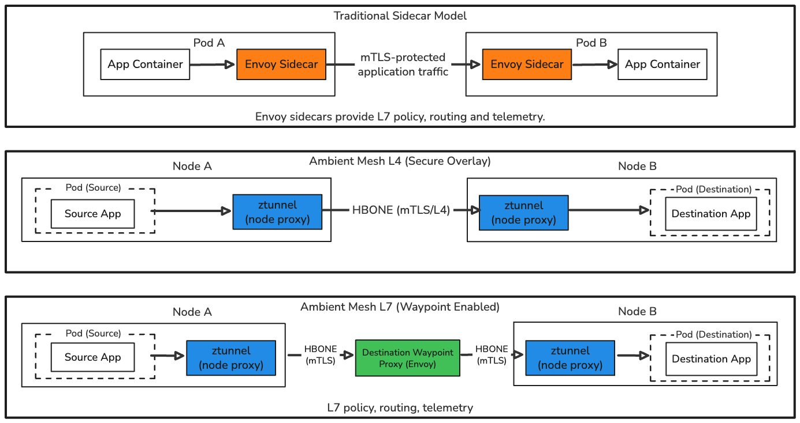

# Istio mTLS Lab

This lab demonstrates Istio mutual TLS, workload identity, L7 traffic management, and a reversible migration from sidecar mode to Ambient mode. Istio mTLS authenticates both workloads and encrypts service-to-service traffic without requiring TLS code in each application.

Kind is the default local example, but the Istio workflow works on any compatible Kubernetes cluster. Only cluster creation and cleanup are Kind-specific. This is a focused learning lab, not a production template or official Istio tutorial.

The lab demonstrates:

- sidecar mTLS in `PERMISSIVE` and `STRICT` mode
- Ambient L4 mTLS through `ztunnel`
- Ambient L7 processing through a waypoint
- sidecar vs Ambient operational differences
- migration validation
- rollback to sidecar mode
- fault injection and circuit breaking before and after migration

`lab-external` always stays outside the mesh.

## Architecture



## Concepts

**Sidecar**: an Envoy proxy container named `istio-proxy` that runs in each application pod and handles mTLS, telemetry, and L7 policy.

**ztunnel**: Ambient's per-node L4 proxy. It provides mesh identity, HBONE tunneling, L4 mTLS, and L4 telemetry without an application sidecar.

**HBONE**: HTTP-Based Overlay Network Environment. Istio uses it to tunnel workload traffic through the Ambient data plane.

**Waypoint**: an Envoy proxy deployed as a Kubernetes Gateway. Ambient uses it for L7 behavior such as HTTP routing, fault injection, circuit breaking, and HTTP telemetry.

**L4 vs L7**: `ztunnel` handles TCP-level security and routing. HTTP-aware Istio routing, policy, and telemetry require a waypoint.

**PeerAuthentication**: Istio policy that controls inbound mTLS requirements in both sidecar and Ambient modes. This lab keeps `STRICT` during migration so `ztunnel` continues to reject plaintext traffic from outside the mesh.

## Sidecar vs Ambient

| Area | Sidecar | Ambient |
|---|---|---|
| Data plane | Envoy in every pod | `ztunnel` per node, optional waypoint |
| Application pod | Contains `istio-proxy` | No Istio sidecar |
| L4 mTLS | Sidecars | `ztunnel` |
| HTTP routing/faults | Sidecars | Waypoint required |
| Circuit breaking | Sidecars | Waypoint for L7 policy |
| Resource model | Proxy per replica | Shared node proxy and waypoint |
| Lifecycle | Coupled to pod rollout | Platform-managed |
| Debugging | `istioctl proxy-status` | `istioctl ztunnel-config workloads` and waypoint checks |

Ambient is not universally better. Sidecars are mature and give each workload a dedicated proxy. Ambient lowers per-pod overhead and separates L4 from L7 processing, but L7 behavior depends on waypoint deployment and Gateway API maturity.

## Sidecar-to-Ambient migration

Ambient is useful when per-pod proxy overhead and sidecar lifecycle coupling are operational concerns. A node-level `ztunnel` provides workload identity, L4 mTLS, and TCP telemetry. Waypoints are optional Envoy proxies used mainly when a namespace needs L7 routing, policy, fault injection, circuit breaking, or HTTP telemetry.

A safe namespace migration configures the waypoint first, enables Ambient while sidecars still protect the workloads, verifies ztunnel enrollment and traffic, removes future sidecar injection, and restarts workloads last:

```sh
./scripts/12-install-ambient-components.sh
kubectl wait --for=condition=programmed --timeout=120s gateway/waypoint -n lab-mesh

kubectl label namespace lab-mesh istio.io/use-waypoint=waypoint --overwrite
kubectl label namespace lab-mesh istio.io/dataplane-mode=ambient --overwrite
istioctl ztunnel-config workloads -n istio-system --workload-namespace lab-mesh
kubectl exec -n lab-mesh deploy/mesh-client -c mesh-client -- curl -fsS http://httpbin-server:8000/get

kubectl label namespace lab-mesh istio-injection-
kubectl rollout restart deployment -n lab-mesh
kubectl rollout status deployment -n lab-mesh
kubectl exec -n lab-mesh deploy/mesh-client -c mesh-client -- curl -fsS http://httpbin-server:8000/get
```

`scripts/13-migrate-to-ambient.sh` performs this sequence and keeps `PeerAuthentication` in `STRICT` mode throughout the migration.

## Prerequisites

The default Kind path uses this fixed compatibility set:

| Component | Version |
| --- | --- |
| Docker | 29.x |
| kind | 0.27.0 |
| Kubernetes node | 1.32.2, pinned by image digest |
| kubectl | 1.32.x |
| Istio / istioctl | 1.30.1 |
| Gateway API CRDs | v1.5.1 |

Other versions may work but are not supported by this POC.

For an existing compatible cluster, skip Phase 1 and make sure the active `kubectl` context targets that cluster. The remaining setup uses `kubectl` and the pinned `istioctl` version.

## Names

| Name | Purpose |
| --- | --- |
| `lab-mesh` | Namespace migrated from sidecar mode to Ambient mode |
| `lab-external` | Namespace outside the mesh |
| `mesh-client` | In-mesh curl client used for tests |
| `external-client` | Out-of-mesh curl client used for mTLS checks |
| `httpbin-server` | HTTP test server |
| `nginx-server` | Simple web server |
| `whoami-server` | Simple identity/debug server |
| `mesh-traffic-generator` | Continuous in-mesh request generator |
| `load-tester` | Fortio load tester for circuit breaker tests |
| `waypoint` | Ambient service waypoint for `lab-mesh` L7 traffic |

## Phase 1: Create a local Kind cluster

```sh
./scripts/00-bootstrap-cluster.sh
```

Skip this Kind-specific step when using an existing compatible Kubernetes cluster.

## Phase 2: Install Istio sidecar profile

```sh
./scripts/01-install-istio.sh
```

This installs the Istio demo profile. It is convenient for learning and not production-ready.

## Phase 3: Install observability

```sh
./scripts/02-install-observability.sh
```

This installs Prometheus, Grafana, and Kiali. The script uses local Istio addon manifests when available, then falls back to matching sample manifests from GitHub.

Open Kiali:

```sh
istioctl dashboard kiali
```

## Phase 4: Deploy sidecar workloads

```sh
./scripts/03-deploy-workloads.sh
```

`lab-mesh` starts with `istio-injection=enabled`, so its application pods contain `istio-proxy`. `lab-external` has no mesh enrollment labels.

Check sidecars:

```sh
kubectl get pods -n lab-mesh -o jsonpath='{range .items[*]}{.metadata.name}{"\t"}{.spec.containers[*].name}{"\n"}{end}'
```

## Phase 5: Test sidecar mTLS

`PERMISSIVE` accepts both mesh mTLS and plaintext from `lab-external`:

```sh
./scripts/04-test-mtls-mode.sh permissive
```

`STRICT` accepts mesh mTLS and rejects plaintext from `lab-external`:

```sh
./scripts/04-test-mtls-mode.sh strict
```

Ambient mTLS is provided by `ztunnel`, which also enforces the retained `STRICT` policy against plaintext inbound traffic.

## Phase 6: Generate traffic

```sh
./scripts/05-start-mesh-traffic.sh
```

The traffic generator calls:

- `http://httpbin-server:8000/get`
- `http://nginx-server`
- `http://whoami-server`


Stop traffic:

```sh
./scripts/06-stop-mesh-traffic.sh
```

## Phase 7: Test sidecar L7 behavior

Enable 50% HTTP 503 fault injection for `whoami-server`:

```sh
./scripts/07-enable-whoami-faults.sh
```

Disable it:

```sh
./scripts/08-disable-whoami-faults.sh
```

Enable and test aggressive circuit breaking for `httpbin-server`:

```sh
./scripts/09-enable-httpbin-circuit-breaker.sh
./scripts/10-test-httpbin-circuit-breaker.sh
```

Disable it:

```sh
./scripts/11-disable-httpbin-circuit-breaker.sh
```

## Phase 8: Install Ambient components

```sh
./scripts/12-install-ambient-components.sh
```

This installs pinned Gateway API CRDs if needed, upgrades the existing Istio install to the Ambient profile, waits for `istiod`, `istio-cni-node`, and `ztunnel`, restarts `lab-mesh` so sidecars receive HBONE interoperability config, and deploys the `waypoint` Gateway.

This phase does not activate the waypoint and does not remove sidecar injection.

## Phase 9: Migrate lab-mesh to Ambient

```sh
./scripts/13-migrate-to-ambient.sh
```

This labels only `lab-mesh` for Ambient and waypoint use, removes future sidecar injection, restarts workloads last, and verifies traffic again through the sidecarless Ambient data plane. The migration is namespace-scoped and reversible.

After migration, `lab-mesh` application pods should not contain `istio-proxy`.

## Phase 10: Validate Ambient mode

```sh
./scripts/14-verify-ambient-mode.sh
```

`ztunnel` provides L4 telemetry. HTTP metrics and L7 behavior require waypoint processing.

## Phase 11: Rerun L7 tests through the waypoint

The existing `DestinationRule` circuit breaker is kept and tested through the waypoint:

```sh
./scripts/09-enable-httpbin-circuit-breaker.sh
./scripts/10-test-httpbin-circuit-breaker.sh
```

The existing fault injection uses an Istio `VirtualService`:

```sh
./scripts/07-enable-whoami-faults.sh
```

Istio 1.30 supports `VirtualService` with waypoints only as an Alpha path. Gateway API `HTTPRoute` is the preferred stable Ambient API, but it does not represent this lab's exact 50% abort fault injection. Do not apply a competing `HTTPRoute` to `whoami-server` at the same time.

## Phase 12: Roll back to sidecar mode

```sh
./scripts/15-rollback-to-sidecar.sh
```

Rollback restores `istio-injection=enabled`, restarts workloads until sidecars are present, removes Ambient namespace labels, ensures the retained `STRICT` mTLS policy is applied, and reruns the original sidecar mTLS test.

It is acceptable for rollback to leave cluster-wide Ambient components installed.

## Cleanup

Cleanup asks for confirmation before deleting the kind cluster:

```sh
./scripts/99-cleanup.sh
```

For non-interactive cleanup:

```sh
./scripts/99-cleanup.sh --yes
```

Because cleanup deletes the whole Kind cluster, it does not separately delete every Ambient resource first. On another Kubernetes cluster, remove the lab namespaces and Istio resources according to that cluster's lifecycle policy instead of running this script.

## Verification

After migrating `lab-mesh` to Ambient mode, use this verification set:

```sh
# Check every shell script for syntax errors.
bash -n scripts/*.sh

# Validate all Kubernetes manifests without changing the cluster.
kubectl apply --dry-run=client -R -f manifests

# Analyze Istio configuration across all namespaces.
istioctl analyze -A

# Run the Ambient mode pass/fail checks.
./scripts/14-verify-ambient-mode.sh

# Check Istio control-plane and data-plane pods.
kubectl get pods -n istio-system

# Confirm ztunnel is scheduled and ready on each node.
kubectl get daemonset ztunnel -n istio-system

# Confirm the namespace waypoint exists and is ready.
kubectl get gateway waypoint -n lab-mesh

# Check sidecar, Ambient, and waypoint namespace labels.
kubectl get namespace lab-mesh --show-labels

# Confirm lab-mesh workloads are enrolled in ztunnel.
istioctl ztunnel-config workloads -n istio-system

# Confirm Ambient application pods do not contain istio-proxy.
kubectl get pods -n lab-mesh -o jsonpath='{range .items[*]}{.metadata.name}{"\t"}{.spec.containers[*].name}{"\n"}{end}'
```
